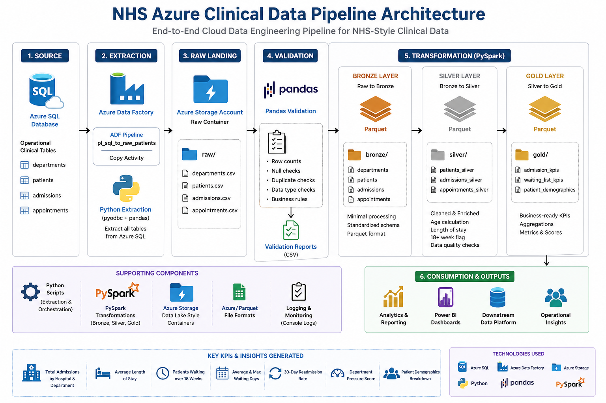

# NHS Azure Clinical Data Pipeline

## Overview

This project simulates an end-to-end NHS-style clinical data engineering pipeline using Azure SQL, Azure Data Factory, Azure Storage, Python, Pandas, PySpark, and SQL.

The project demonstrates how NHS style operational data can be extracted from Azure SQL, landed into a cloud data lake, validated, transformed through Bronze/Silver/Gold layers and prepared for analytics and downstream platform ingestion.

## Architecture

Azure SQL Database
        ↓
Azure Data Factory / Python Extraction
        ↓
Azure Storage Raw Container
        ↓
Pandas Data Validation
        ↓
Bronze Layer
        ↓
Silver Layer
        ↓
Gold KPI Layer
        ↓
Analytics / Reporting / Downstream Platform

## Technologies Used

- Azure SQL Database
- Azure Data Factory
- Azure Storage / Data Lake style containers
- Python
- Pandas
- PySpark
- SQL Server T-SQL
- Parquet
- GitHub

## Data Pipeline Layers

### Source

Azure SQL tables:

- departments
- patients
- admissions
- appointments

### Raw Layer

CSV extracts from Azure SQL landed into Azure Storage.

### Bronze Layer

Initial Parquet datasets generated from raw extracts.

### Silver Layer

Cleaned and enriched datasets including:

- Patient age calculation
- Duplicate patient checks
- Length of stay calculation
- Waiting over 18 weeks flag

### Gold Layer

Business ready KPI datasets:

- Admission_kpis
- Waiting_list_kpis
- Patient_demographics

## Advanced SQL Analytics

The project includes advanced SQL KPI scripts using:

- CTEs
- Joins
- Aggregations
- ROW_NUMBER()
- LAG()
- CASE expressions
- DATEDIFF()
- Readmission-style logic
- Department pressure scoring

SQL file:

src/sql/advanced_nhs_kpis.sql

## Key KPIs Produced

- Total admissions by hospital and department
- Average length of stay
- Active admissions
- Patients waiting over 18 weeks
- Average waiting days
- 30-day readmission-style rate
- Department pressure score
- Patient demographic breakdown

## Project Structure

nhs-azure-clinical-data-pipeline/
│
├── data/
│   ├── local_extracts/
│   ├── validation_reports/
│   ├── bronze/
│   ├── silver/
│   └── gold/
│
├── src/
│   ├── azure_extract/
│   ├── config/
│   ├── data_generation/
│   ├── pandas_validation/
│   ├── pyspark_transforms/
│   └── sql/
│
├── docs/
├── images/
└── README.md

## How to Run

python -m src.azure_extract.test_sql_connection
python -m src.azure_extract.run_sql_file
python -m src.data_generation.load_sample_data_to_sql
python -m src.azure_extract.extract_sql_to_raw_storage
python -m src.pandas_validation.validate_raw_extracts
python -m src.pyspark_transforms.raw_to_bronze
python -m src.pyspark_transforms.bronze_to_silver
python -m src.pyspark_transforms.silver_to_gold
python -m src.pyspark_transforms.view_gold_outputs
python -m src.azure_extract.upload_pipeline_outputs

## Azure Data Factory

ADF pipeline created:

pl_sql_to_raw_patients

Purpose:

Azure SQL dbo.patients
        ↓
ADF Copy Activity
        ↓
Azure Storage raw/adf_extract/patients.csv

## Business Value

This project demonstrates how healthcare operational data can be moved from source systems into a governed analytics ready structure.

It supports use cases such as:
- Patient flow monitoring
- Waiting list analysis
- Repartment pressure reporting
- Readmission trend analysis
- Operational KPI dashboards

## Portfolio Summary

Built an NHS style Azure clinical data pipeline using Azure SQL, Azure Data Factory, Azure Storage, Python, Pandas, PySpark, and advanced SQL. The project implements source extraction, raw landing, validation, Bronze/Silver/Gold transformation layers, KPI generation, and cloud storage publication.

## Future Improvements

- Parameterised ADF pipeline for all source tables
- Azure Key Vault for secrets
- SQLAlchemy based extraction
- Power BI dashboard
- CI/CD with GitHub Actions
- Automated data quality checks
- Incremental loading strategy

## Author

Marcello Da Silva Lopes
